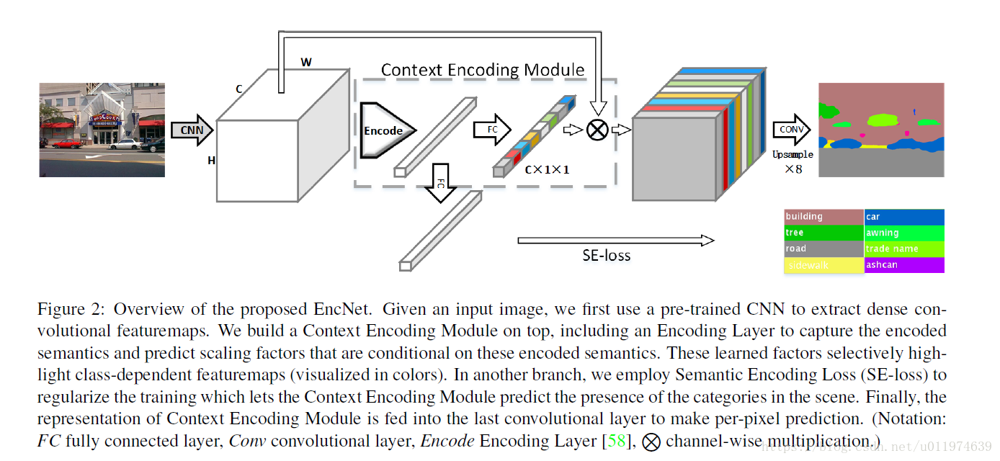
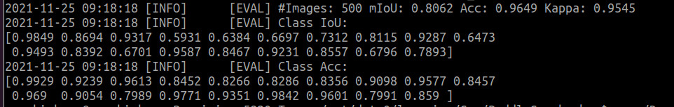

# ENCNet_paddle

## 1 介绍
  
本项目基于paddlepaddle框架复现了ENCNet语义分割模型，ENCNet提出上下文编码模块，用来提升语义分割结果，同时加入全局语义监督loss——se loss，用来保证对小目标的分割结果。结构框架如图所示。

**论文：**
- [1] Hang Zhang, Kristin Dana, Jianping Shi, Zhongyue Zhang, Xiaogang Wang, Ambrish Tyagi, Amit Agrawal. [Context Encoding for Semantic Segmentation](https://paperswithcode.com/paper/context-encoding-for-semantic-segmentation)

## 2 训练环境
- 硬件: Tesla V100 32G * 4

- 框架:
    - PaddlePaddle == 2.2.0

- backbone:
    - resnet101
- 训练策略
    - steps:80k
    - sgd 

## 3 验证精度
>在CityScapes val数据集的测试效果如下图。

  
mIOU: 80.62

[训练日志](log/workerlog.0)
## 3 数据集
[CityScapes dataset](https://www.cityscapes-dataset.com/)

## 上手
### 初始化
```bash
# clone this repo
git clone https://github.com/Shun14/ENCNet-paddle.git
cd ENCNet-paddle
pip install -r requirements.txt
```

### 训练模型
单卡训练：
```bash
python3 train.py --config configs/encnet/encnet_resnet101_os8_cityscapes_1024x512_80k.yml  --log_iter 100 --save_interval 1000 --do_eval --use_vdl 
```
多卡训练：
```bash
python3 -m paddle.distributed.launch train.py --config configs/encnet/encnet_resnet101_os8_cityscapes_1024x512_80k.yml  --log_iter 100 --save_interval 1000 --do_eval --use_vdl 
```

### 测试模型
```bash
python3 val.py --config configs/encnet/encnet_resnet101_os8_cityscapes_1024x512_80k.yml --model_path models/iter_80000model.pdparams
```
